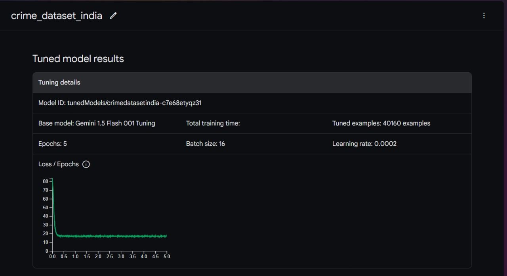
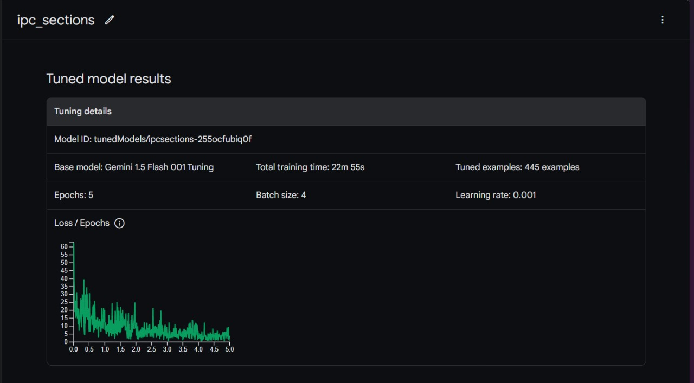
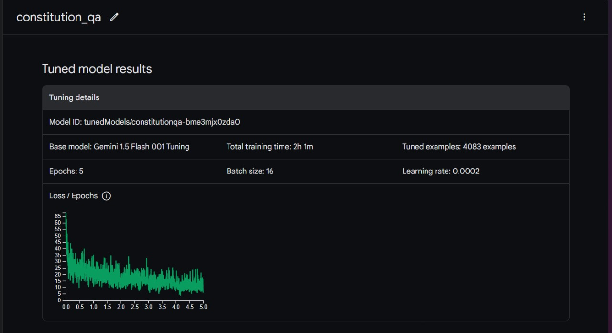

# Nomos - AI Law Chatbot

**Nomos** is an AI-powered legal chatbot designed to assist users with inquiries on Indian law. Trained on a dataset of 45,000 legal queries specific to Indian legal systems, Nomos provides accurate and insightful responses by leveraging advanced AI techniques, including agents, chain-of-thought reasoning, and Retrieval-Augmented Generation (RAG) using the Gemini API.

---
## 📽 Demonstration

### Watch How Nomos Works:

<video controls src="20241027-0148-23.2433515.mp4" title="Nomos Demonstration"></video>

🔗 **Drive Link:** [NomosBot Demonstration](https://drive.google.com/file/d/1tZ-UjY9qsI-w_Xk3Rucz91K6PcJuPNR3/view)

🔗 **Deployed Link:** [NomosBot](https://nomosbot.netlify.app)

---
## 🚀 Features

✅ **Expert Legal Assistance**: Provides insights on Indian law, covering civil, criminal, corporate, and property law.

✅ **Agent-Based Reasoning**: Uses multiple AI agents to enhance legal query understanding.

✅ **Chain-of-Thought Processing**: Breaks down complex legal queries into structured steps for accurate responses.

✅ **Retrieval-Augmented Generation (RAG)**: Enhances response accuracy by combining real-time legal data retrieval with AI-generated answers.

✅ **Gemini API-Powered**: Utilizes advanced AI models for precise legal assistance.

✅ **Strictly Answers Law-Based Queries**: Ensures responses remain within the legal domain.


---
## 🎨 Frontend Technology Stack

- **React.js**: Dynamic user interface.
- **Tailwind CSS**: Fast and responsive styling.

---
## 🔗 Future Collaboration

We aim to collaborate with government bodies to access comprehensive legal datasets. This will further improve Nomos’ accuracy and reliability for users and the legal system.

---
## 🛠 Installation Guide

### 1️⃣ Clone the Repository:
```bash
git clone https://github.com/your-username/Nomos.git
cd Nomos
```

### 2️⃣ Install Backend Dependencies:
Ensure Python 3.8+ is installed, then run:
```bash
pip install -r requirements.txt
```

### 3️⃣ Install Frontend Dependencies:
```bash
cd frontend
npm install
```

### 4️⃣ Set Up Gemini API Access:
- Get your API key from Gemini.
- Create a `.env` file and add:
  ```
  GEMINI_API_KEY=your_gemini_api_key
  ```

---
## 💡 Usage

### 🏁 Start the Frontend:
```bash
npm start
```

### 💬 Interacting with Nomos:
Open `http://localhost:3000` and start chatting! Example:

**User:** *What are the laws on property inheritance in India?*  
**Nomos:** *Indian inheritance law is governed by various statutes, depending on religion, region, and type of property...*

---
## 🧠 AI Training Process

  
  
  

Nomos was trained on:
- **45,000+ Indian legal queries** across multiple domains.
- **Custom AI model architecture** integrating chain-of-thought reasoning and RAG for enhanced legal comprehension.

🔗 **For fine-tuning & re-training, refer to:** `training/README.md`

---
## 📊 Presentation & Documentation

📑 **Presentation:** [NomosBot Pitch Deck](https://docs.google.com/presentation/d/1d-mF3thxNbclZhfZ4unQAMH694v1yD3a/edit?usp=drive_web&ouid=110808746669281974824&rtpof=true)


